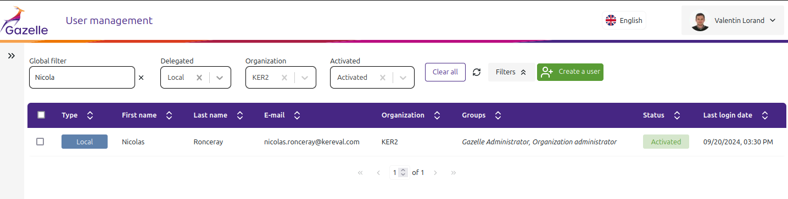
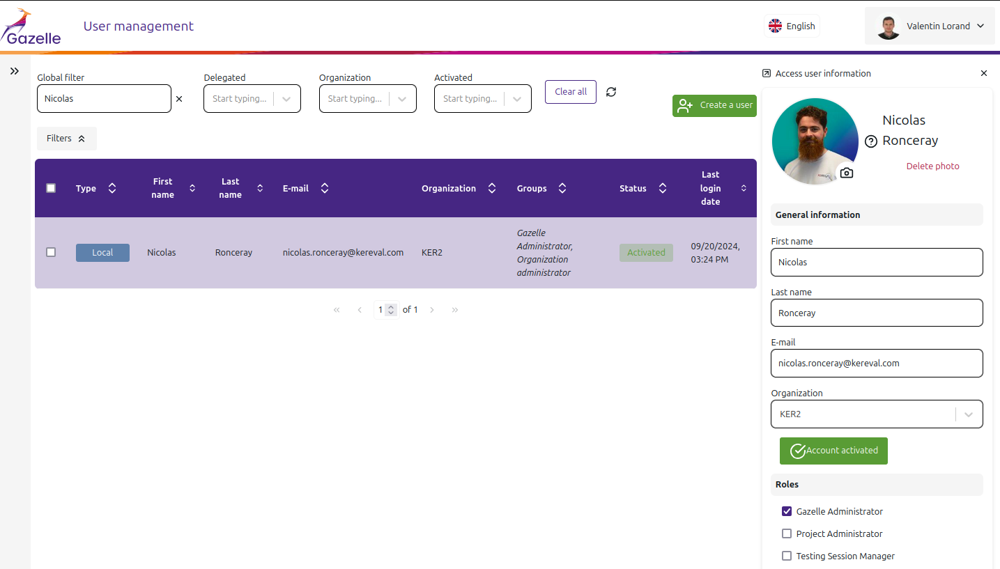
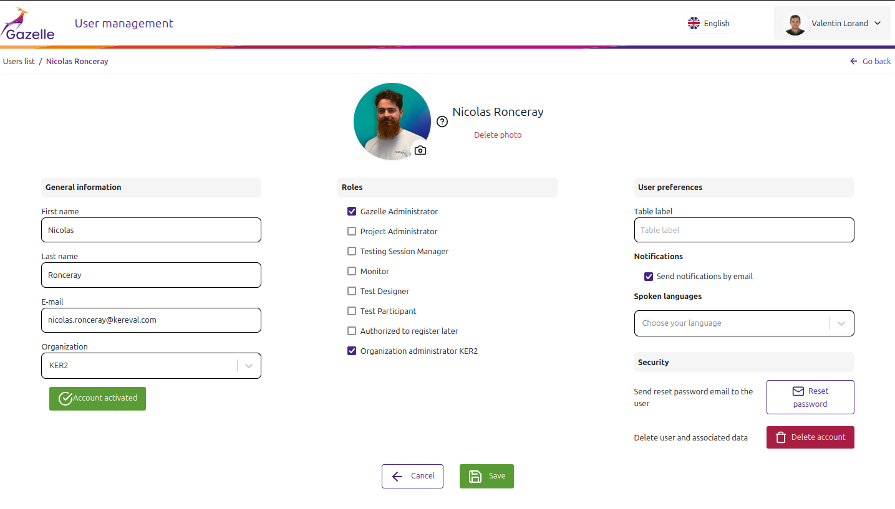
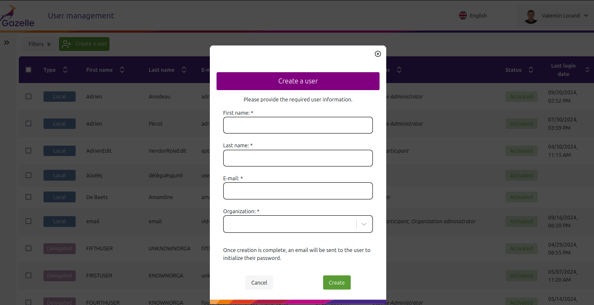

# Gazelle Administrator manual

<!-- TOC -->
* [Gazelle Administrator manual](#gazelle-administrator-manual)
  * [Manage users](#manage-users)
    * [Search for users](#search-for-users)
    * [Edit users](#edit-users)
    * [Enable/Disable users](#enabledisable-users)
    * [Delete users](#delete-users)
  * [Create user](#create-user)
  * [Reset users consent](#reset-users-consent)
<!-- TOC -->

## Manage users

To manage users, you can use the Gazelle User Management Interface application.

From the interface, as an administrator, you can:

- Search for users
- Edit users (firstName, lastName, email, roles, organization)
- Edit user preferences (pictureProfile, languages, tableLabel, etc.)
- Enable/Disable users
- Delete users
- 
>:information_source: **Note:**

> If you are organization administrator, you can only manage users from your organization.

### Search for users

From the listing user page. You can filter users that you want to display in the table and so perform a search.

Four different filters are available :
- Global search : search on firstName, lastName and email attribute of each user (case-insensitive).
- Delegation status : Only display users that are delegated or not.
- Organization filtering : Only display users that belongs to a selected organization.
- Activated status : Only display disabled user or enabled ones.



### Edit users

By clicking of the line of the table, you can open the right panel edition form. 

From this panel you can display more information about a user and also directly update information of the selected user.



You can also expand the right panel to display the info on a full screen page.



### Enable/Disable users

In the edition, you have the possibility to enable or disable a user depending on his activation status.

You can also enable never-activated users. If the user doesn't succeed to activate his account with the activation url received by mail.

### Delete users

You can also delete a user from the edition form. Pay attention, this action can't be undone. All the user information will be erased.

All the associated data in other Gazelle applications will become orphans.

## Create user

It's possible for admins to create user from the user management interface.

To do this, click on the `Create user` button next to the filters. This button will open a modal with a creation form.



This form is composed of four inputs. To submit the form, you need to enter the firstName, the lastName, the email and the organization of the new user.

When you submit the form, an email is sent to the entered email in order to inform the user that a Gazelle account has been created.

He must set his password using the reset password feature of Keycloak. this indication is given in the received mail.

>:information_source: **Note:**

> If you are organization administrator, you can only create users for your organization.

## Reset users consent

If you want to reset users consent, you can use the sql script `reset_users_consent.sql`:

This script should be available next to the jar file of the gazelle-user-management-quarkus project.

Retrieve this script and execute it with the following command:

```bash
psql -h 127.0.0.1 -U gazelle -d gum < reset_users_consent.sql
```

>:warning: **WARNING** This execution will reset all users consent. All the users will be asked to give their consent again at the next login.

If you want to reset only one user consent, you can adjust the command in the script and execute it manually.