# Keycloak administrator manual

<!-- TOC -->
* [Keycloak administrator manual](#keycloak-administrator-manual)
  * [Access to Keycloak administration console](#access-to-keycloak-administration-console)
  * [Users](#users)
    * [Create a new account](#create-a-new-account)
    * [Search a user](#search-a-user)
    * [Update password of a user](#update-password-of-a-user)
    * [Gazelle groups](#gazelle-groups)
    * [Give access to admin console to a Gazelle User](#give-access-to-admin-console-to-a-gazelle-user)
    * [Status of Gazelle accounts](#status-of-gazelle-accounts)
      * [Inactive](#inactive)
      * [Temporarily locked](#temporarily-locked)
  * [Groups](#groups)
  * [Events](#events)
  * [Sessions](#sessions)
    * [Session expiration](#session-expiration)
  * [Realm settings](#realm-settings)
    * [Email](#email)
    * [Themes](#themes)
    * [Security defenses](#security-defenses)
      * [Brute force Detection](#brute-force-detection)
  * [References](#references)
<!-- TOC -->

## Access to Keycloak administration console

To access the administration console you need to go to *base_url/auth* and select "Administration console".
It will ask you to enter the credentials of a Keycloak administrator account. If no administrator account exists, you will
see a form where you will be able to create it.

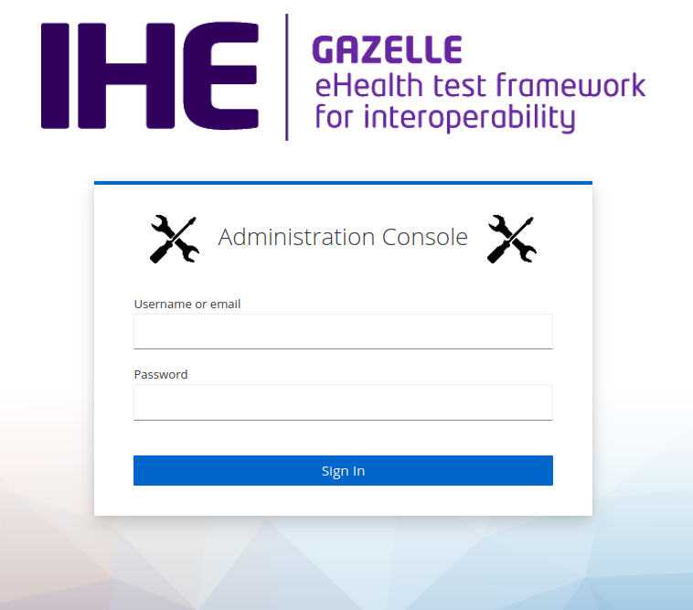

>:warning: **Warning:**
> This account exists only in Keycloak, so if you log with your administrator account from Test Management it 
will not work.

## Users

### Create a new account

Since Gazelle User Management step 2, it's no longer possible to create a new account from Gazelle Test Management.

You need to go to the admin console interface of Keycloak to perform this action.

1. Go to the admin console in the user management section

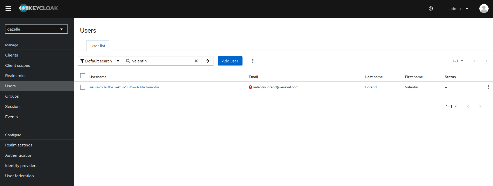

2. Click on Add user button and fill the form

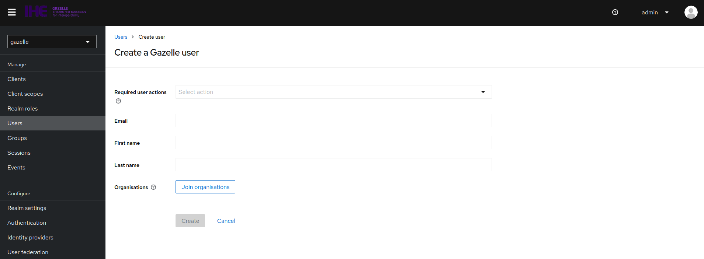

>:warning: **WARNING** You can select only one organization, avoid to select multiple organizations.

3. Submit the form.

The user will receive an email to set its password. The new user is enabled by default.

The new user must accept the terms of use before being able to log in.

If you want to switch the organization of the user, you can do it from the admin console by editing the user. It can be done from Gazelle TM too.

>:warning: **WARNING** User created from the admin console of Keycloak haven't any role. You must add them manually.

If you want to add roles to the user, you can do it from the admin console by editing the user. It can be done from Gazelle TM too.

### Search a user

You can search users by their username or email. If you want to see all users, search for "*". Click on the user username
to see more details.

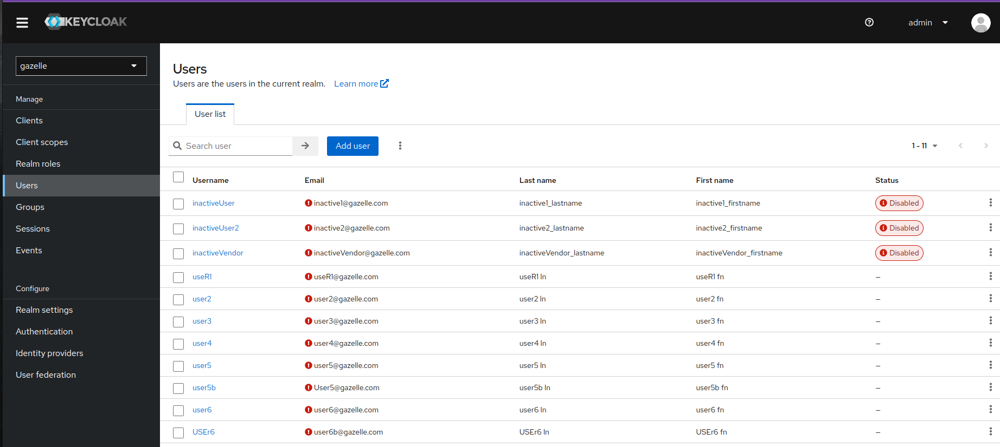

### Update password of a user

If you want to update the password of a user, go to the "credentials" tab. Click on set 
password and you will see this :

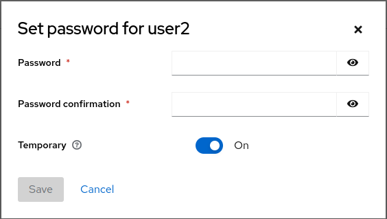

>:information_source: **Note:**
> If the "Temporary" option is enabled, the user will be asked to change their password on next login.

### Gazelle groups

A Gazelle user can have different groups.

Some of these groups are static, we called them roles :

- role:gazelle_admin - Gazelle administrator with all permissions.
- role:project_admin - Gazelle administrator at project level
- role:monitor - Gazelle monitor that can be affected to a testing session as a monitor in TM.
- role:testing_session_manager - Manage a testing session.
- role:late_registration - Authorized to register some systems after the limit date.
- role:test_designer - Test designer
- role:sut_operator - Test participant (default role)

Some other groups are dynamic like organization membership

- org:KEREVAL - Member of the organization KEREVAL
- org-adm:KEREVAL - Administrator of the organization KEREVAL

The groups are associated to Keycloak realm roles. They are created if they don't exist when users are retrieved.

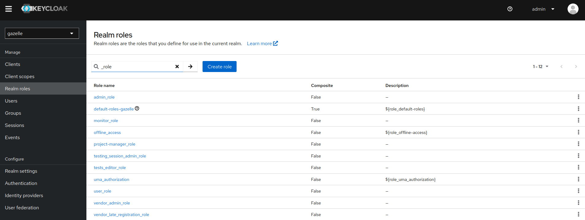

When using **CAS** authentication protocol, the roles are defined in Keycloak user attributes in order to be given
the correct format in the token.

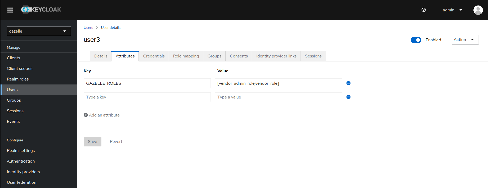

### Give access to admin console to a Gazelle User

It's possible to give the permissions to access the admin console to a Gazelle User.

To do this, you need to be able to manage users in the admin console.

1. Go to the admin console in the user management section

2. Select the user you want to give access to the admin console and go to the role mapping tab

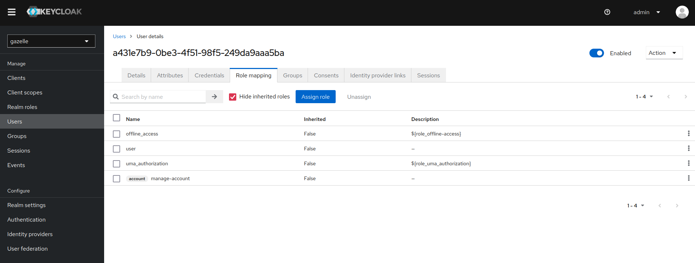

3. Click on Assign role and select "Filter by clients".

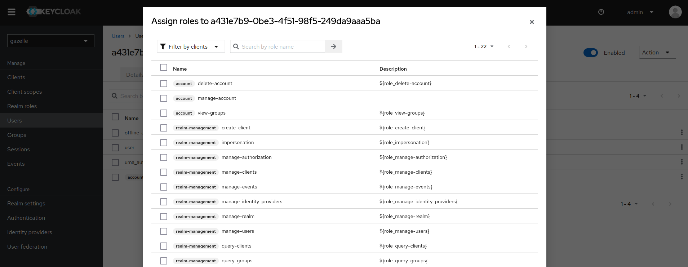

4. Select the following roles and assign them to the user :
- `[realm-management] query-realms`
- `[realm-management] query-users`
- `[realm-management] query-groups`
- `[realm-management] manage-users`
- `[realm-management] view-events`

5. Click on Add selected roles

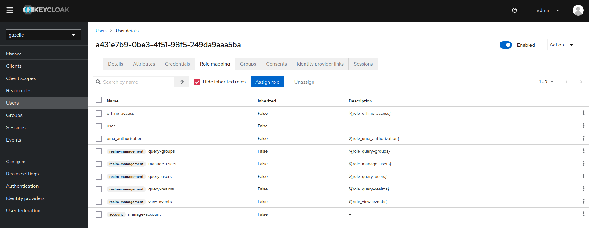

6. The user can now access the admin console by browsing the following URL : [https://${FQDN}/auth/admin/gazelle/console](https://${FQDN}/auth/admin/gazelle/console)

### Status of Gazelle accounts

A Gazelle account can be in different states.

#### Inactive

The default status after an account creation. The user can't log in.

There are 2 possibilities :
- The new user created its own organization. He will receive an email with a link to activate his account.
- The new user ask to join an organization. He will receive an email saying that he must wait until his account is activated by an admin.

#### Temporarily locked

If a user account is temporarily blocked due to too many failed login attempt, you can unblock it by going on the "Details"
tab and untoggle the "Temporarily locked" option.

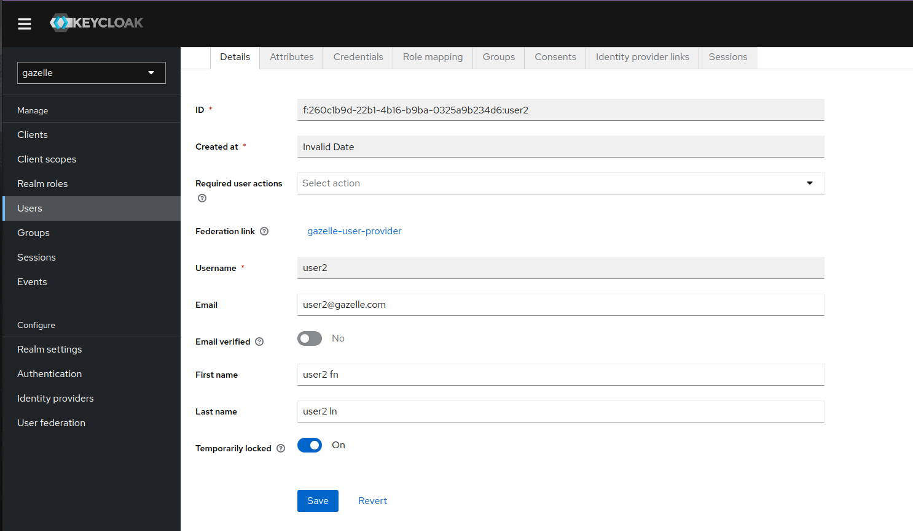

This is a keycloak automatism for a brute force protection.

See [brute-force-security section](#brute-force-detection) for more information about the configuration of this protection.

The validation of the email for each user is currently not supported by GUM.

## Groups

In this section you will be able to search groups.

Each organization is a group in Gazelle User Management :
- The name of the group is the keyword of the organization
- The id of the group is the hash of the keyword of the organization prefixed by "org:"

>:warning: **Warning:**
>Note that groups are created, if needed, when searching for users, so if there is no group or if one is missing,
search one user that is a member or search them all.

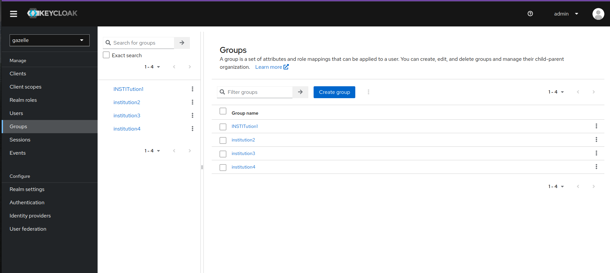

## Events

In this section you will be able to see all the events logged by keycloak like a login, a login error or a logout.

Here are the user events :

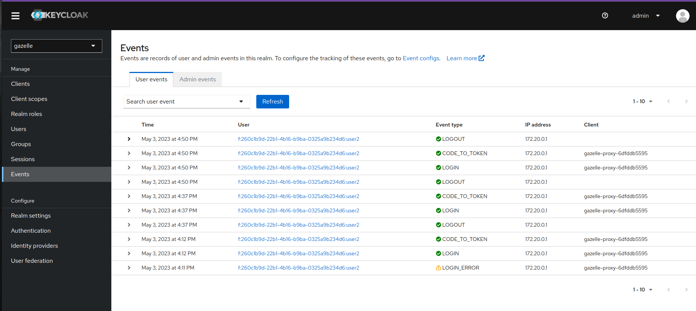

In the "Event listeners" tab, you can configure which event listeners you want to use, if there is any. If you want to
add a new event listener see [here](../../keycloak-provider/README.md).

In the "User/Admin events settings", you can configure the management of the different events.

## Sessions

It is possible to see all active sessions from user logged in registered clients in the "Sessions" tab.

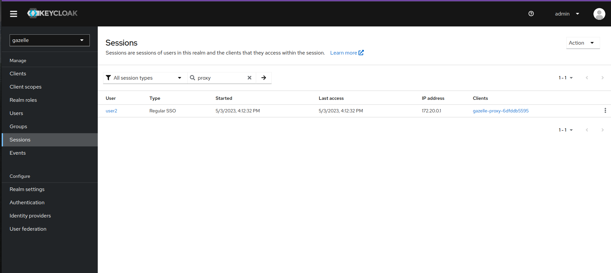

>:information_source: **Note:**
>You can delete sessions and it will act as a logout for the concerned user.

### Session expiration

There is a custom Gazelle implementation regarding session expirations. The default Keycloak implementation doesn't 
manage expirations of the sessions (Server and Client sides).

The CAS server provides expiration information in the ticket delivered to the client. `authentication_timestamp` and 
`ticket_session_max_duration_seconds` data will give to the client
the possibility to check if the session is still valid. In case of expiration, the client will invalidate its session 
in order to force a renewal of the ticket.

When the maximum duration of a session is reached, (few hours) the client will not be able to renew its ticket and will
be redirected to the CAS login page.

To limit the possibility of de-synchronization between session of the CAS server and the client, the 
`ClientSessionIdleTimeout` configuration of Keycloak must be lower than the `SSOSessionIdleTimeout`.

Here you can find the default configuration of the timeout session (extract from the realm settings) :

- **ssoSessionIdleTimeout** : 40 minutes
- **ssoSessionMaxLifespan** : 12 hours
- **clientSessionIdleTimeout** : 20 minutes
- **clientSessionMaxLifespan** : 12 hours

These configuration can be changed in the realm settings like below :

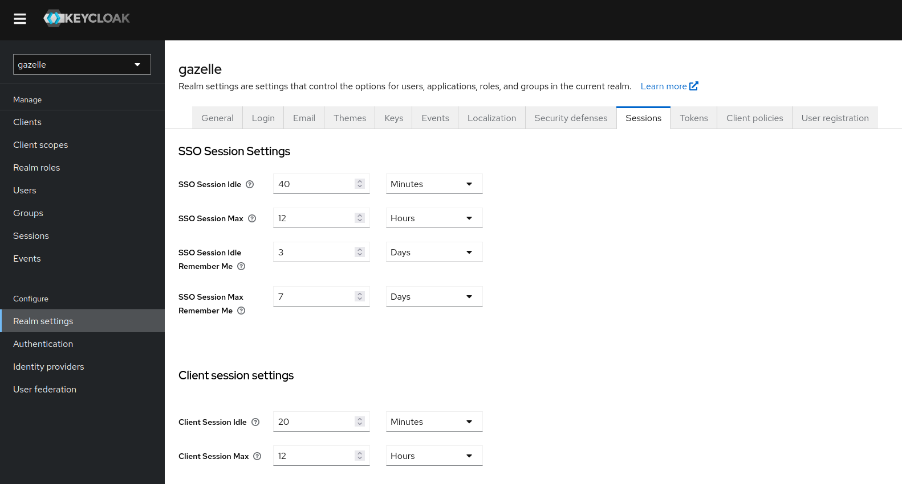

WARNING : It is not possible to set specific timeout for specific identity provider.
If an identity provider is set up on a platform, and it has a lower session timeout (lets say 5min), the most restrictive
configuration must be used as the global realm settings. So the clientSessionIdleTimeout shall be set to 5min in the previous example.

## Realm settings

### Email

In this tab, you will be able to configure the email template (sender, sender display name, reply to, ...).

You can also edit the smtp configuration to make Keycloak use your smtp server.

### Themes

In this tab, you will be able to choose which theme you want to use for the login, the account, the admin UI and for
emails. As of today, only the login page and the emails have custom gazelle themes and are configured to use them by default.

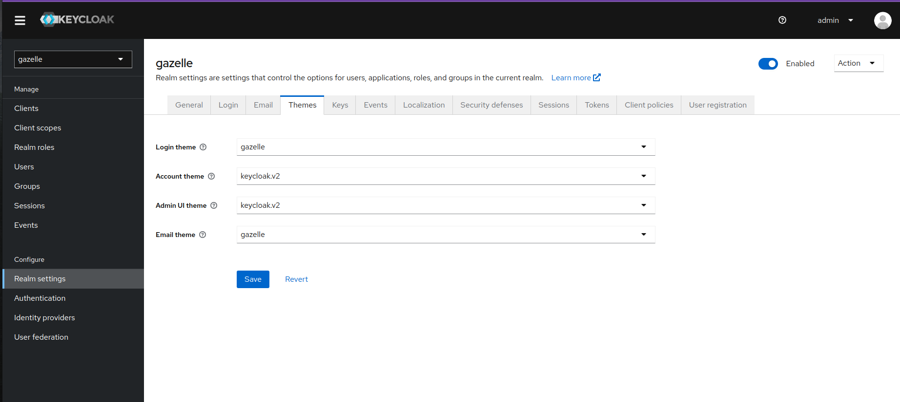

For more info on how create and use your own custom theme, see [here](../../keycloak-theme/README.md).

### Security defenses

#### Brute force Detection

The brute force detection in the gazelle realm has the following settings:
- Permanent Lockout: false
- Max Login Failures: 5
- Wait increment: 1 minute
- Quick login check: 1 second
- Minimum quick login wait: 1 minute
- Failure Reset Time : 12 hours
- Minimum Quick Login Wait: 1 minute

The way this works is that if there are **Max Login Failures** during a period of **Failure Reset Time**,
the account is temporarily disabled for the **Wait Increment** multiplied by the number of failures over the max.
After **Failure Reset Time** is reached all failures are wiped clean.
The **Max Wait** is the maximum amount of time an account can be disabled.
Another preventive measure is that if there are subsequent login failures for one account that are too quick
for a human to initiate the account will be disabled. This is controlled by the **Quick Login Check** value.
So, if there are two login failures for the same account within that value,
the account will be disabled for **Minimum Quick Login Wait**.

This configuration is accessible in _Realm Settings -> Security Defenses -> Brute Force Detection_.

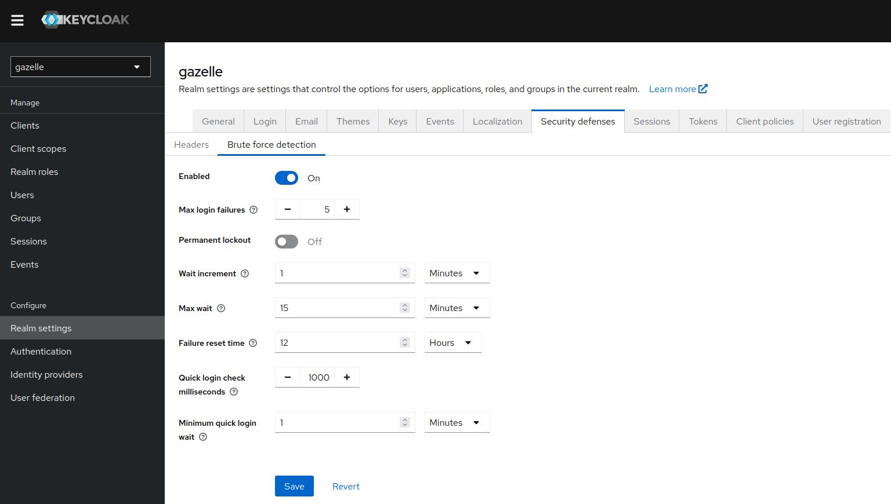

>:warning: **Warning:**
Temporary locked accounts are not persisted in the keycloak database.
This means that if the keycloak server is restarted, all the locked accounts will be unlocked.

### Limit number of parallel sessions

It's possible to limit the number of sessions for a user in the `gazelle-browser` authentication flow.

To do this, you need to go to the "Authentication" tab in the realm settings and edit the `gazelle-browser` flow.

Add a new execution and select the script `User session count limit`. Move this execution in at the end of the flow.

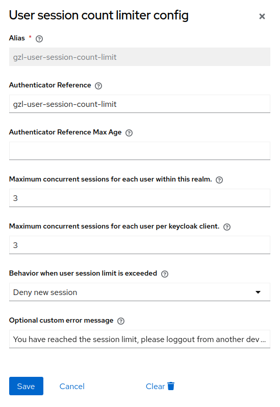

## References

[Keycloak Brute Force Security](https://www.keycloak.org/docs/latest/server_admin/#password-guess-brute-force-attacks)
