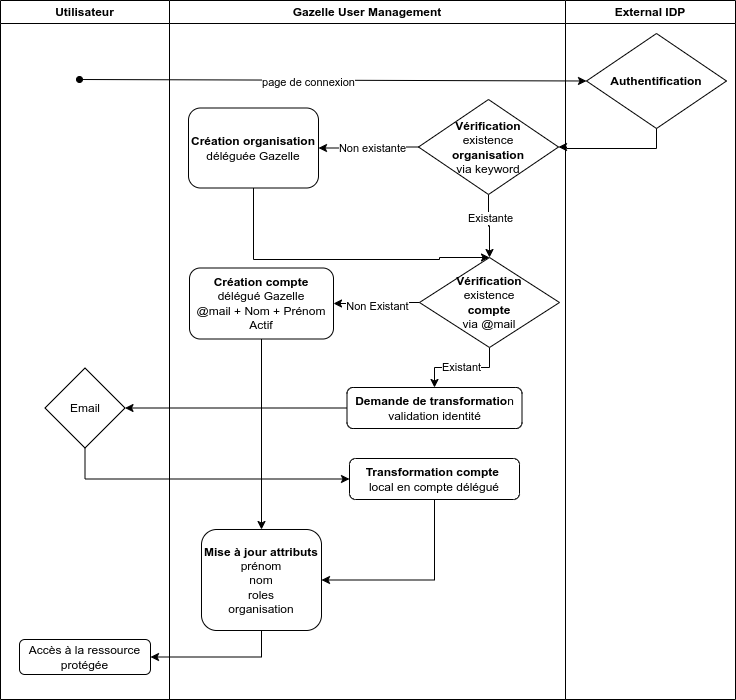

# Gazelle authentication delegation

Gazelle supports the delegation of authentication to an external identity providers.

##  Authentication flow

There are four different actors in a Gazelle delegation authentication process.

- The user who wants to authenticate.
- The Gazelle application which provide the protected resources.
- The Identity broker which is responsible for the authentication of the user, in our case, the Identity broker is the Keycloak server.
- The Identity provider which is the source of the user's identity, in our case, the Identity provider can be any external identity provider.

Below, a diagram of ordered interactions between the actors during the authentication process.

### OpenID Connect protocol

As Protocol of authentication between Keycloak and external IDP, we are using the OpenID Connect protocol.

This standard is used by many authorization systems, it's secure and Keycloak already implements it.

More documentation about OpenID Connect can be found [here](https://openid.net/developers/how-connect-works/).

We are using the Authorization Code Flow with PKCE (Proof Key for Code Exchange) for the authentication process. 

Some documentation about the Authorization Code Flow with PKCE can be found [here](https://auth0.com/docs/get-started/authentication-and-authorization-flow/authorization-code-flow-with-pkce).

### SAML protocol

Keycloak also implements the SAML protocol, which is another standard for authentication. But we didn't get the chance to test it yet.

It's supposed to work the same way as OpenID Connect, but we need to test it first.

## First login

The first login of a delegated user is when the most of the actions are performed. Below, you can find a state diagram of what happens during the first login of a delegated user.

