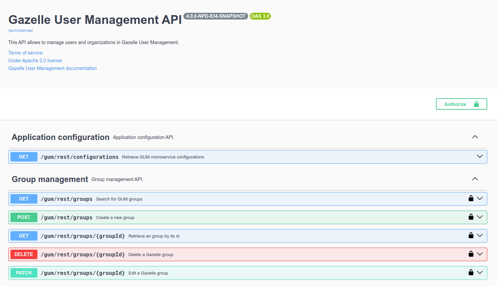

# REST APIs

GUM is microservice that exposes REST APIs to manage users of Gazelle.

These APIs are used by other Gazelle applications to retrieve or directly edit the users if they need. 

The GUM-UI application is also using the APIs to display all the information for a good user experience.

## Swagger-UI

It's possible to have a visual on all the available endpoint with some documentation to explain of to use the API.

We use [Swagger-UI](https://swagger.io/) for this. The compiled swagger of GUM is available at runtime at the following path `/gum/swagger-ui`.

>:warning: **WARNING** Pay attention to the environment variable `QUARKUS_SWAGGER_UI_ENABLE`.

Example of result : 

To generate this, we use open-api annotations from microprofile in interface of web service controllers.

## Protected endpoints

Some endpoints are public. This mean that everyone can use them. Among these public endpoints there are configuration, metadata and organization retrieval.

Most of the endpoint are **protected** (symbolised in the swagger with a lock). These endpoints need a Gazelle account with permissions to be called.

Swagger has an OIDC integration to directly log in with a Gazelle account and use the API (see [oidc-authentication](./oidc-authentication.md) section).