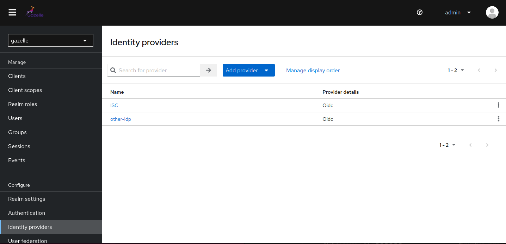
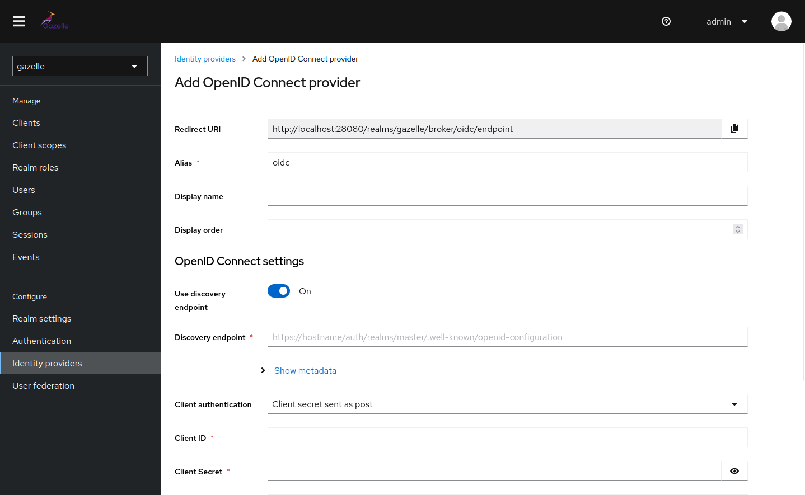
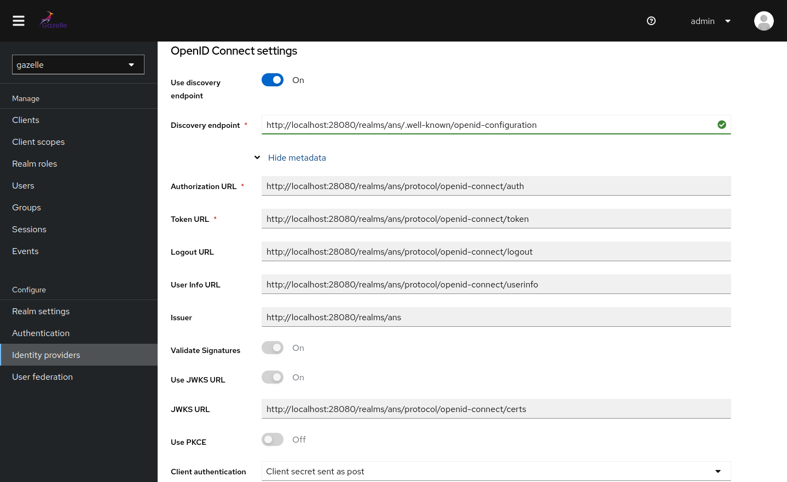
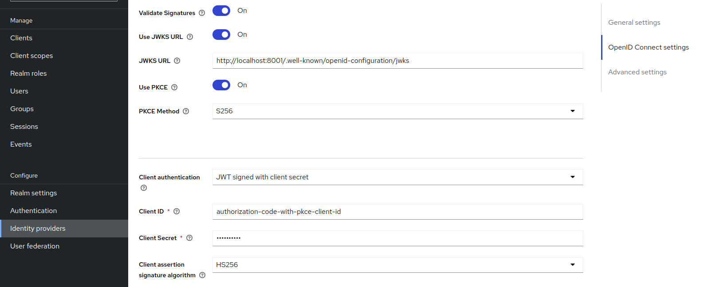
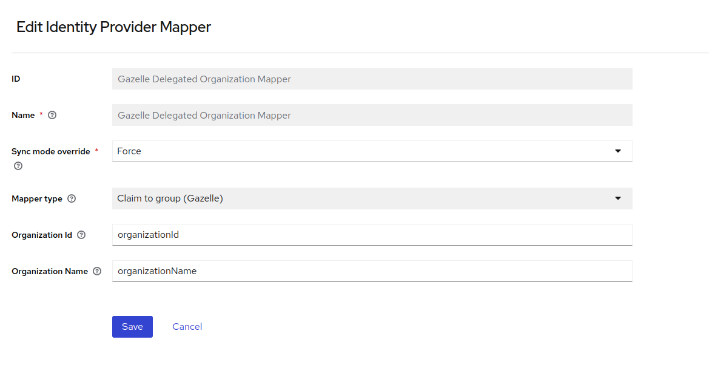
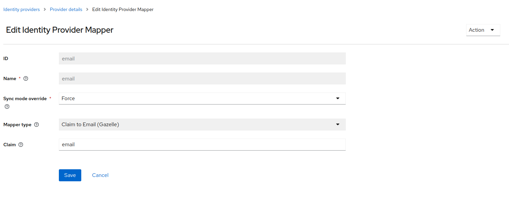
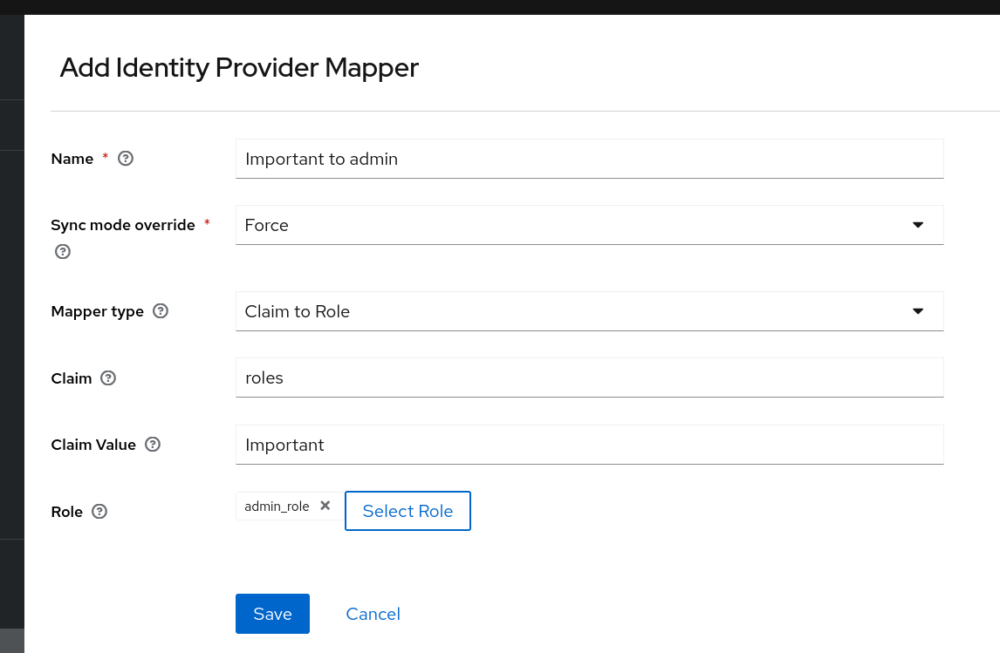

# Delegation configuration

This guide will explain to you how to configure the delegation in Keycloak.

<!-- TOC -->
* [Delegation configuration](#delegation-configuration)
  * [From Keycloak Admin Console](#from-keycloak-admin-console)
  * [Add an identity provider](#add-an-identity-provider)
    * [Additional settings](#additional-settings)
  * [Add mappers](#add-mappers)
    * [Delegated organization mapper](#delegated-organization-mapper)
    * [Email mapping to resolve email conflict](#email-mapping-to-resolve-email-conflict)
    * [Role mapping for delegated user](#role-mapping-for-delegated-user)
  * [From Keycloak API](#from-keycloak-api)
    * [User attribute mapper](#user-attribute-mapper)
  * [Custom first broker login flow](#custom-first-broker-login-flow)
  * [Custom authenticator for delegated user block local login](#custom-authenticator-for-delegated-user-block-local-login)
    * [Block local login of delegated user](#block-local-login-of-delegated-user)
    * [Block reset password of delegated user](#block-reset-password-of-delegated-user)
<!-- TOC -->


## From Keycloak Admin Console

The first possibility is to configure the delegation from the Keycloak Admin Console. You can to be logged in as a 
Keycloak administrator to do this.

## Add an identity provider

Go to the `Identity Providers` section and click on the `Add provider` button.



Select the `OpenID Connect v1.0` type of provider.



Set the `Alias` and the `Display name` of the provider (the display name will show in the button of the login form).

Set the discovery URL of the provider. This URL is the URL of the provider's metadata. For example, if you want to
configure the delegation with the Keycloak server, you can set the URL `http://localhost:28080/auth/realms/master/.well-known/openid-configuration`.



Set the `Client ID` and the `Client Secret` of the provider. These values are provided by the provider.

### Additional settings

You can set the `Default Scopes` to say to Keycloak which scope Keycloak should request to the provider.
Some specific settings such as using PKCE or client-assertion support may be requested for the identity provider configurations.
The client-assertion is activated if the selected client authentication method is JWT signed with client secret.



## Add mappers

In order to set the user attributes that Keycloak should request to the provider, you need to add a mapper to the provider.

Go to the `Mappers` section and click on the `Create` button.


### Delegated organization mapper

To set the organization of the delegated user, you need to add a mapper of type **Claim to group (Gazelle)**.  
To create this mapper, go, in Keycloak, to the identity provider you want and then select the **mapper** tab. Click on **Add mapper** 
and give it a name. In **Mapper type** select **Claim to group (Gazelle)**. Set the **Sync mode override** to "Force" to update the user
at every authentication. The **claim** field is the name of claim in the JSON Web Token containing the id of the organization.
Lastly, hit the save button.


Here is an example of what your mapper could look like:




### Email mapping to resolve email conflict

To set the email of the delegated user, we need to be sure that this email is not already used in Gazelle. To do so, you need to add
a mapper of **Claim to email (Gazelle)**. To create this mapper, go, in Keycloak, to the identity provider you want and then select the **mapper** tab. Click on **Add mapper**
and give it a name. In **Mapper type** select **Claim to email (Gazelle)**. Set the **Sync mode override** to "Force" to update the user
at every authentication. The **claim** field is the name of claim in the JSON Web Token containing the email.
Lastly, hit the save button.




### Role mapping for delegated user

For Gazelle to understand the roles of a user coming from an identity provider, we need to add a **Claim to role** mapper
in Keycloak. To create this mapper, go, in Keycloak, to the identity provider you want and then select the **mapper** tab. 
Click on **Add mapper** and give it a name. Set the **Sync mode override** to "Force" to update the user
at every authentication. In **Mapper type** select **Claim to Role**, then in **claim** put the name 
of claim containing the role.s. In claim value put the name of the role as it is in the identity provider. Then select
the role you want give for this case. Repeat for every role you want to map.

>:warning: **Warning**
>
> The value of the **claim** field is case-sensitive.
> If you need to map several roles from external identity provider to a unique Gazelle rôle, you need to create ony one advanced role mapper. 
> (Otherwise, the last mapper will revoke the role of the user if there is no match)

Here is an example of a role mapper:



In this example, this mapper will map the role **admin_role**, from Gazelle, with the role **Important** from the identity
provider.


## From Keycloak API

It's also possible to import the delegation configuration using the Keycloak API.

Example of JSON to import the delegation configuration:

```json
{
  "alias": "oidc-ans",
  "displayName": "My Custom External IDP",
  "internalId": "b991d4a5-4f6c-4db3-9830-d4c4fdbeb101",
  "providerId": "oidc",
  "enabled": true,
  "updateProfileFirstLoginMode": "on",
  "trustEmail": false,
  "storeToken": false,
  "addReadTokenRoleOnCreate": false,
  "authenticateByDefault": false,
  "linkOnly": false,
  "firstBrokerLoginFlowAlias": "first broker login",
  "config": {
    "acceptsPromptNoneForwardFromClient": "false",
    "tokenUrl": "http://localhost:28080/realms/ans/protocol/openid-connect/token",
    "jwksUrl": "http://localhost:28080/realms/ans/protocol/openid-connect/certs",
    "isAccessTokenJWT": "false",
    "filteredByClaim": "false",
    "backchannelSupported": "false",
    "issuer": "http://localhost:28080/realms/ans",
    "loginHint": "false",
    "clientAuthMethod": "client_secret_post",
    "syncMode": "IMPORT",
    "clientSecret": "**********",
    "allowedClockSkew": "0",
    "hideOnLoginPage": "false",
    "userInfoUrl": "http://localhost:28080/realms/ans/protocol/openid-connect/userinfo",
    "validateSignature": "true",
    "clientId": "gazelle-delegated",
    "uiLocales": "false",
    "disableNonce": "false",
    "useJwksUrl": "true",
    "pkceEnabled": "false",
    "authorizationUrl": "http://localhost:28080/realms/ans/protocol/openid-connect/auth",
    "disableUserInfo": "false",
    "logoutUrl": "http://localhost:28080/realms/ans/protocol/openid-connect/logout",
    "passMaxAge": "false"
  }
}
```

We will detail each recommended mapper.

### User attribute mapper

>:information_source: Note
> 
> When **syncMode** value is FORCE, it will override the user property for each authentication.

- Update the user's lastName with the value of the `family_name` claim at each user login.

```bash
{
  "id": "6b910c9c-7dde-408a-a45b-396c7773d93f",
  "name": "lastName-mapper",
  "identityProviderAlias": "ans",
  "identityProviderMapper": "oidc-user-attribute-idp-mapper",
  "config": {
    "syncMode": "FORCE",
    "claim": "family_name",
    "user.attribute": "lastName"
  }
}
```

- Update the user's firstName with the value of the `given_name` claim at each user login.

```bash
{
  "id": "f70eff55-981b-4af7-ab33-36154ca580c8",
  "name": "firstName-mapper",
  "identityProviderAlias": "ans",
  "identityProviderMapper": "oidc-user-attribute-idp-mapper",
  "config": {
    "syncMode": "FORCE",
    "claim": "given_name",
    "user.attribute": "firstName"
  }
}
```

- Update the user's email with the value of the `email` claim at each user login.

```bash
{
  "id": "bc93e0dd-712d-4a5c-8810-a47980b6ac07",
  "name": "email-mapper",
  "identityProviderAlias": "ans",
  "identityProviderMapper": "gazelle-email-idp-mapper",
  "config": {
    "syncMode": "FORCE",
    "claim": "email",
    "user.attribute": "email"
  }
}
```

- Update the user's roles with a map of the `roles` claim at each user login.

```bash
{
  "id": "50c02db7-169f-4395-bda3-3491348f35b5",
  "name": "ans-role to admin_role",
  "identityProviderAlias": "ans",
  "identityProviderMapper": "oidc-advanced-role-idp-mapper",
  "config": {
    "claims": "[{\"key\":\"roles\",\"value\":\".*ans-role1.*\"}]",
    "syncMode": "FORCE",
    "are.claim.values.regex": "true",
    "role": "admin_role"
  }
}
```

- Import hardcoded roles for all users

```bash
{
  "id": "b94658dd-e7a9-4423-b592-b9010f52a64e",
  "name": "user_role",
  "identityProviderAlias": "ans",
  "identityProviderMapper": "oidc-hardcoded-role-idp-mapper",
  "config": {
    "syncMode": "FORCE",
    "role": "user_role"
  }
}
```

- Update organization for all users

Update `organizationId` and `organizationName` configurations depending on the claim of the user token.

```json
{
  "id": "8359844f-300b-4576-9709-1da55e8b0e25",
  "name": "Gazelle delegated organization mapper",
  "identityProviderAlias": "DELEG_Mock",
  "identityProviderMapper": "gazelle-group-idp-mapper",
  "config": {
    "organizationId": "organizationId",
    "syncMode": "FORCE",
    "organizationName": "organizationName"
  }
}
```

## Custom first broker login flow

In order to customize the first broker login flow, you need to create a custom first broker login flow.

The first we need to do is to replace the **Review profile** with our custom one. For that click on **Add step** and select
**Review profile (Gazelle)**.Then drag and drop him in first position. Set its **Requirement** to **Required** Then click on the gear to set the organization claim name.
Give it the alias you want and then set the claim name to the one in the user token.

Now you can safely remove the Keycloak **Review profile**.

## Custom authenticator for delegated user block local login

### Block local login of delegated user
To have a mechanism of blocking the login in a delegated account you'll have to configure a custom authenticator as a browser flow.
Simply go to the Authenticator configuration, duplicate the browser flow.
Delete the **Username Password Form** and replace it by our custom "**Block user if delegated (Gazelle)**" form.
Then configure this flow as the **browser flow** to use by default. For that go to action in the top left, then select 
**bind flow** and select **browser flow**.

### Block reset password of delegated user
To have a mechanism of blocking the reset password of a delegated account you'll have to configure a custom authenticator as a reset credential flow.
Simply go to the Authenticator configuration, duplicate the reset credential flow.
Delete the **Send reset email** and replace it by our custom "**Block delegated users reset password (Gazelle)**" form.
Then configure this flow as the **browser flow** to use by default. For that go to action in the top left, then select
**bind flow** and select **browser flow**.