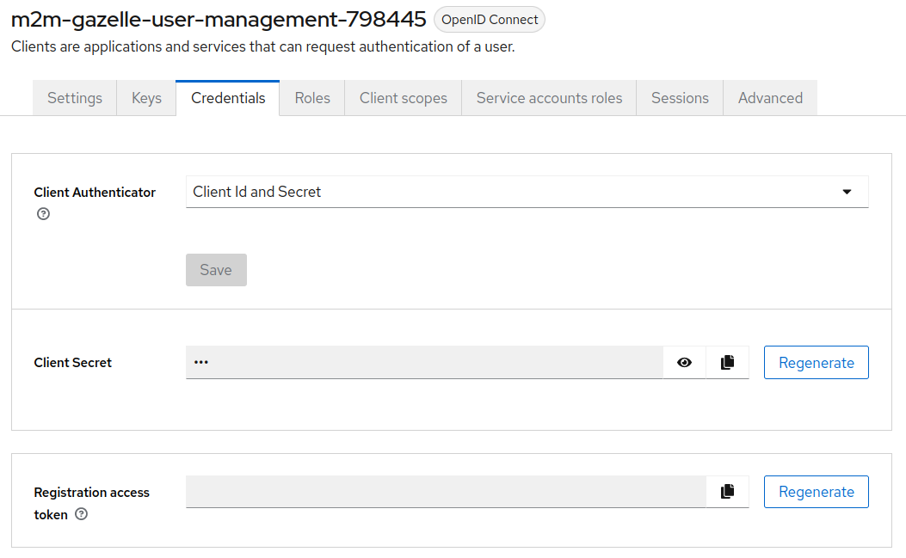
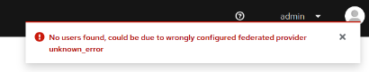

# GUM troubleshooting guide

If you encounter some problems with GUM you can check the different errors and their solutions here.
If your problem is not here, and you managed to solve it, do not hesitate to update this guide !

<!-- TOC -->
* [GUM troubleshooting guide](#gum-troubleshooting-guide)
* [Error during registration of an application](#error-during-registration-of-an-application)
  * [Using GUM 1.X.X](#using-gum-1xx)
  * [Using GUM version 2.X.X and superior](#using-gum-version-2xx-and-superior)
  * [Getting an HTTP 404 when registering](#getting-an-http-404-when-registering)
* [Error while retrieving organization](#error-while-retrieving-organization)
* [Error while searching users in Keycloak admin console](#error-while-searching-users-in-keycloak-admin-console)
* [Keycloak admin console infinite redirect](#keycloak-admin-console-infinite-redirect)
<!-- TOC -->

# Error during registration of an application

For applications to work with Keycloak they need to register themselves in Keycloak.

## Using GUM 1.X.X

**Dependency or application version**:

- **sso-client--v7** $\geq$ 2.X.X && $\leq$ 3.X.X

For Test Management v 7.X.X, EVSClient v 6.3.X, Proxy-v7 v 5.1.X
Be sure to check if these environment variable are correct :

```txt
KC_CLIENTS_ADMIN_USERNAME
KC_CLIENTS_ADMIN_PASSWORD
KC_ADMIN_CLIENT_SECRET
```

These variables should be the same in GUM and in your application .env (or .env.dev if in local).

## Using GUM version 2.X.X and superior

**Dependency or application version**:

- **sso-client-v7** $\geq$ 3.X.X
- **sso-client-v17** $\geq$ 1.X.X

For **all** applications.

Be sure to check if these environment variable are correct :

```txt
GZL_SSO_ADMIN_EMAIL
GZL_SSO_ADMIN_USER
GZL_SSO_ADMIN_PASSWORD
```

These variables should be the same in GUM and in your application .env (or .env.dev if in local).

## Getting an HTTP 404 when registering

If you have a similar error to this:

```shell
2024-10-16 09:55:52,754 ERROR () [net.ihe.gazelle.ssov7.registration.interlay.client.SSOClientRegister] (ServerService Thread Pool -- 57 ) 
/!\ Failed to register CAS resources to SSO server. This may leads to further issues.: net.ihe.gazelle.ssov7.registration.domain.SSOClientRegistrationException:
 404 Not Found with body: <html><body><h1>Resource not found</h1></body></html>
```

Then it means that Keycloak is up but your application try register using the wrong url, thus resulting in an HTTP 404
error.

To fix this error please check that your **GZL_SSO_URL** is up-to-date with the **KC_HTTP_PATH** and
**KC_HTTP_RELATIVE_PATH** variable.
See example below:

Bad configuration:

Keycloak variables:

```shell
KC_HOSTNAME_URL="${SCHEME}://my-keycloak-url.com"
KC_HTTP_PATH="/auth"
KC_HTTP_RELATIVE_PATH="/auth"
```

Your app variables:

```shell
GZL_SSO_URL="${SCHEME}://my-keycloak-url.com"
```

In this example your application will try to register using ```my-keycloak-url.com``` instead of
```my-keycloak-url.com/auth```, and it will result in an HTTP 404 error. You need to update either **KC_HTTP_PATH** and
**KC_HTTP_RELATIVE_PATH** to just ```"/"``` or update **GZL_SSO_URL** to ```"${SCHEME}://my-keycloak-url.com/auth"```

Here is one good configuration:

Keycloak variables:

```shell
KC_HOSTNAME_URL="${SCHEME}://my-keycloak-url.com"
KC_HTTP_PATH="/auth"
KC_HTTP_RELATIVE_PATH="/auth"
```

Your app variables:

```shell
GZL_SSO_URL="${SCHEME}://my-keycloak-url.com/auth"

```

# Error while retrieving organization

**Dependency or application version**:

- **GUM** $\geq$ 2.X.X

It may be caused by a bad client credentials used for M2M operations.
When GUM needs to retrieve protected information from another endpoint it uses a token to authorize itself.

To get this token it uses the following env var:

```txt
GZL_M2M_CLIENT_SECRET
```

Verify the value is the same in keycloak. For that, go to admin console -> gazelle realm -> clients ->
m2m-<my-client-name-instanceId-replicaId> -> credentials -> client secret.

Here is the page you want :


# Error while searching users in Keycloak admin console

**Dependency or application version**:

- **GUM** version:  $\geq$ 3.X.X

If when you search a user in Keycloak admin console you see this notification:



Check the logs, you should have errors about non existing transactions.

Then it means prepared_statement are disabled or not supported by your database. 

Your postgresql is not correctly configured. If you are using gazelle-database, check that you are up-to-date because default prepared transaction are set to  by default (referto the variable POSTGRES_OVERLOAD_max_prepared_transactions_VALUE).

If you are not using postgresql, you can manually edit the file `postgresql.conf`. Edit the
_max_prepared_transactions_ configuration (example of location `/etc/postgres/14/main/postgresql.conf`).

For the value you can set it to 150. You will need to restart the database, and you can use this command _SHOW
max_prepared_transactions;_, when connected to a database, to verify that it took effect.

# Keycloak admin console infinite redirect

If you have this error make sure you have this configured in your Apache2 configuration :

```shell
<Location /auth>
ProxyPass    http://<hostname>:<port>/auth
ProxyPassReverse http://<hostname>:<port>/auth
RequestHeader set X-Forwarded-Proto "https"
RequestHeader set X-Forwarded-Port "443"
Header edit Set-Cookie ^(.*)HttpOnly;(.*)$ $1$2
</Location>
```

> :warning: **Warning:** For now it is unknown why but this must be at the end of the configuration file or else it will
> not be taken in account by apache2. If already here but not at the end, please add it again at the end of the
> configuration.


Some Keycloak cookies are needed for the admin console and may not be processed by JavaScript if the cookie is marked
**HttpOnly**. So the rule above exclude the Keycloak cookies to be marked as **HttpOnly**.

Reference: https://keycloak.discourse.group/t/redirect-loop-logging-into-master-realm-behind-apache-reverse-proxy/8395/2
