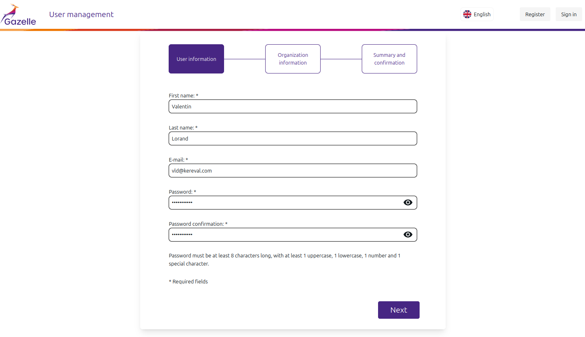
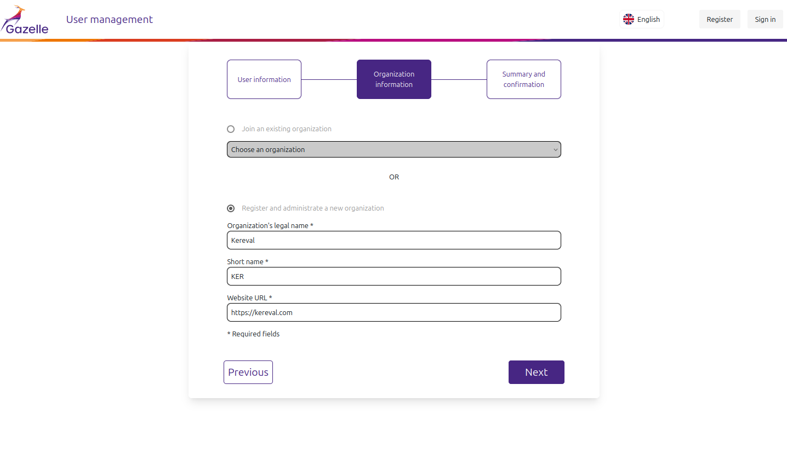
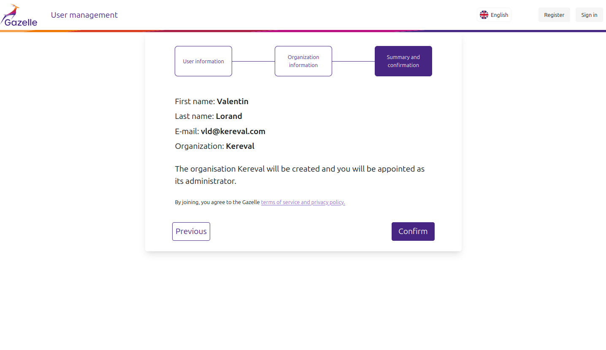
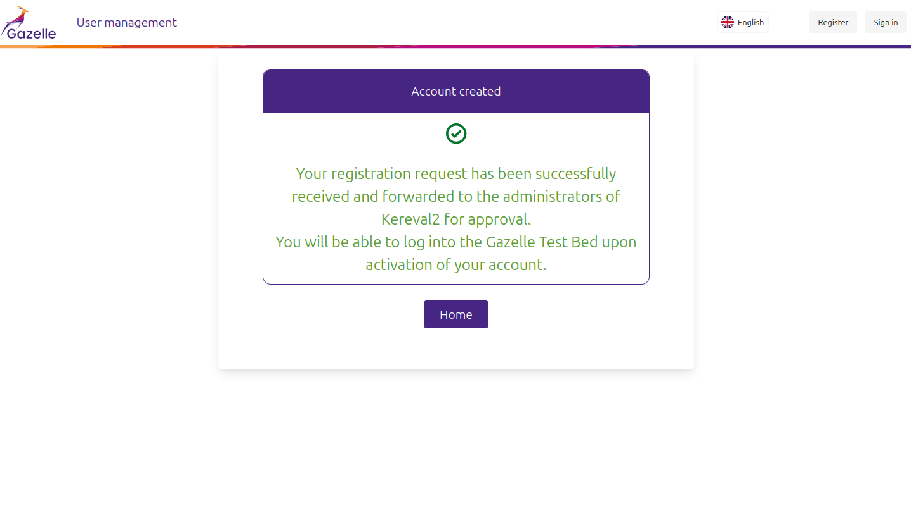
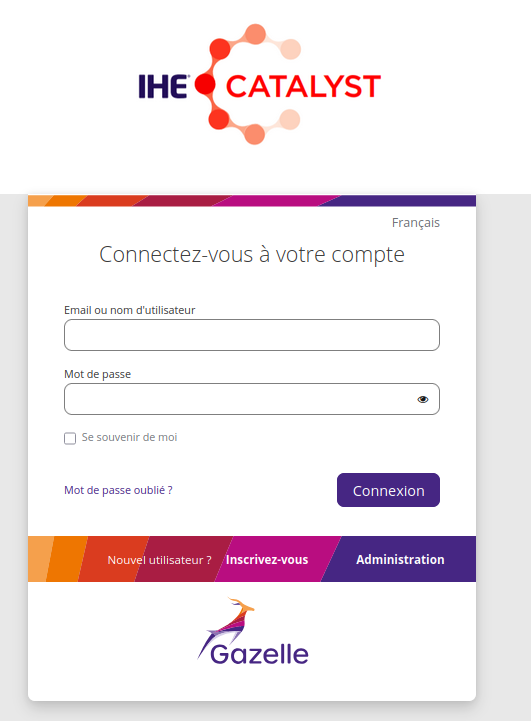
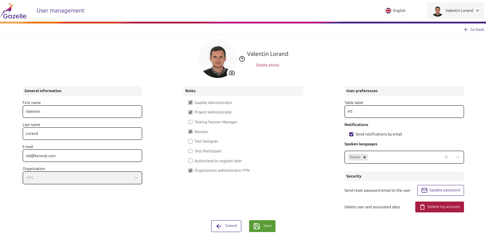
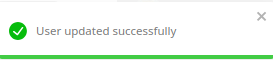
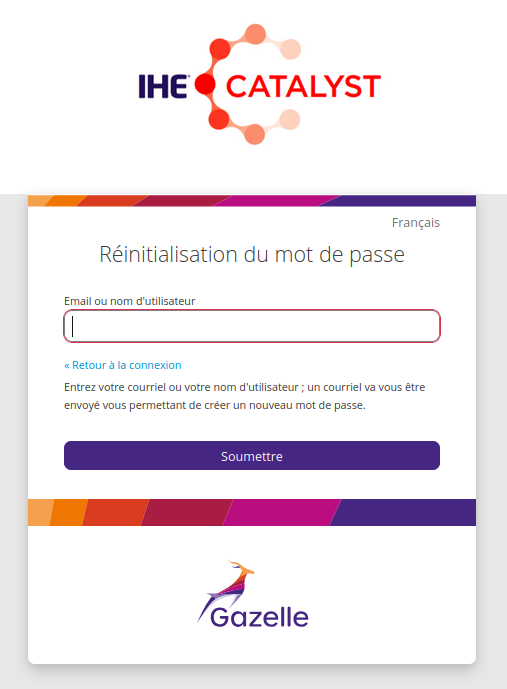
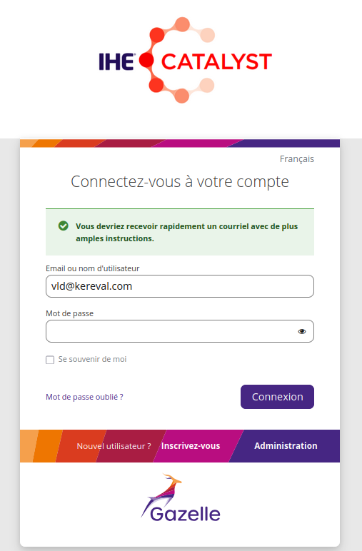

# User manual

<!-- TOC -->
* [User manual](#user-manual)
  * [Register a new account](#register-a-new-account)
    * [1. User information](#1-user-information)
    * [2. Organization information](#2-organization-information)
    * [3. Registration summary and terms of service](#3-registration-summary-and-terms-of-service)
    * [4. Result of the registration](#4-result-of-the-registration)
  * [Log in to Gazelle](#log-in-to-gazelle)
  * [Manage your account](#manage-your-account)
    * [Update your email](#update-your-email)
    * [Upload your profile picture](#upload-your-profile-picture)
    * [Update your preferences](#update-your-preferences)
    * [Reset your password](#reset-your-password)
    * [Delete your account](#delete-your-account)
  * [Localization](#localization)
<!-- TOC -->

## Register a new account

As a new Gazelle user, you need to register an account. To do so, go to the login page and click on "Register".

You should be redirected to the registration form. The registration process is declined in 3 parts.

### 1. User information

Start the registration by entering your personal information (firstname, lastname, email, password and password confirmation)

Pay attention to the password policy :
- Password must be at least 8 characters long
- Password must contain at least one lowercase and one uppercase letter
- Password must contain at least one number
- Password must contain at least one special character

### 2. Organization information

In the second screen, you have the choice to join an existing organization or create a new one. 
If you choose to join an organization, you need to select the organization in the list. 
If you choose to create a new organization, you need to enter the name of the organization, the shortname and the url of the website of the organization.

### 3. Registration summary and terms of service

Last screen is a summary of the information you entered. It also informs you that by creating an account, you agree to the terms of service of Gazelle.

After the registration, if your created a new organization, you will receive an email to activate your own account.
If you ask to join an organization, you need to wait for an administrator of the organization to accept your request.

Once your account is activated, you can log in to Gazelle applications using your email and password.

### 4. Result of the registration

After the registration, you will be redirected to a page that informs you that your account has been created with more information about the next steps to activate your account.

## Log in to Gazelle

Once you have an account, and it is activated, you can log in to Gazelle. 
To do so, go to the login page, enter your email and password and validate the form.

## Manage your account

When you are connected, you can access to your account page. In this page your can visualize your information account. 

You can edit some information like your firstName, lastName, email and preferences.

For a modification to be effective, you must confirm the form. A validation message will appear to confirm the update.

### Update your email

If you update your email. A specific email modification flow will be triggered.

The account associated to the email is disabled. 

Two emails are send. One to the old mail address to inform the user that the mail has been updated, and it's not possible to log in with this email. 

The second email is sent to the new address with an activation url. The user must re-activate his account with this activation url.

In case of trouble, an admin can manually activate the user from the edition form.

### Upload your profile picture

It's possible to upload a custom profile picture in Gazelle. This picture is useful to recognize people during testing sessions.

There are some requirements regarding these profile pictures.

- The profile picture must be in the format JPEG, PNG or GIF.
- The profile picture mustn't exceed 3 MB.
- The profile picture must respect Gazelle terms of service.

At any time, you can delete your profile picture and so you will get the default image.

### Update your preferences

Your account has some preferences that you can adjust. 

Same as profile picture, these preferences gives to other more information on yourself in order to facile the communications between test participants.

Gazelle is always thinking in interoperable ways !

Among these preferences you can find : 

- Table label : Correspond to your table/localisation in the testing session room.
- Send notification by email : Parameter to send Gazelle notifications by email or not.
- Spoken languages : List of languages that you can speak.

### Reset your password

If you forgot your password, you can reset it by clicking on "Forgot Password ?" on the login form. It's also possible from the account management page.

The application will ask your email to send you a link to reset your password.

### Delete your account

You have the possibility to definitively delete your Gazelle account. Be careful, This action cannot be undone.

The information regarding your user will be deleted. All created systems or executed tests will become orphan data in other Gazelle applications. These data will be purged in the future.

As soon your confirmation your intention to delete the account, you are logout from Gazelle and you can't log for the eternity.

## Localization

The language used for emails and interfaces is determined by the locale configured in your browser. Only English and French
actively supported. Italian, Japanese, Finnish, Swedish, German, Chinese simplified, Polish and Spanish are partially supported.

