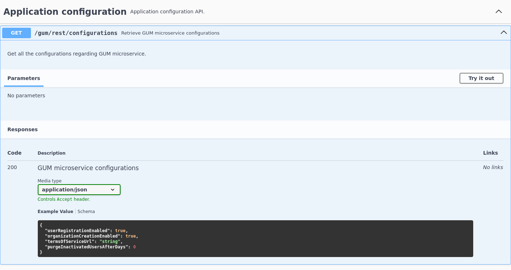

# User Management Quarkus

This module contains all the necessary class for the deployment of the User Management Quarkus side. For information on the 
Keycloak side please see this [directory](../../gazelle-keycloak).

<!-- TOC -->
* [User Management Quarkus](#user-management-quarkus)
  * [Run in dev mode](#run-in-dev-mode-)
  * [Application properties](#application-properties)
  * [Controller](#controller)
  * [OpenAPI and Swagger](#openapi-and-swagger)
  * [Scheduled jobs](#scheduled-jobs)
  * [Database migration](#database-migration)
<!-- TOC -->


## Run in dev mode 

To run this module in dev mode you can follow the steps here [Quarkus-README.md](Quarkus-README.md).


## Application properties

Quarkus uses properties to help with the configuration of the application. Quarkus expose a lot of them by default and,
it is possible add custom ones if it is needed. All of these properties can be found in the [application.properties](./src/main/resources/application.properties).

Sometimes you want to have multiple configuration depending on the context, like for example using a different password 
in production or in a test. For that, you can specify which profile you want for the property. By default, Quarkus provides 
3 profiles:
- prod -> the default profile when no other profile is set
- dev -> profile used when the application runs in dev mode
- test -> profile used when tests are running

It is possible to create new profile by just one property with your custom profile, see here [https://quarkus.io/guides/config-reference#custom-profiles](https://quarkus.io/guides/config-reference#custom-profiles).

To specify the profile you need to write your property like this`%profile_name.my.propertie`.

>:warning: Warning: Some properties from Quarkus are resolved during runtime and other during build time. Check the 
> Quarkus documentation to know when a property is resolved [https://quarkus.io/guides/all-config](https://quarkus.io/guides/all-config)

## Controller

Controllers are the class that will expose the rest API for the application. You will find the interface and their 
implementation here. The interfaces rely on the Jakarta annotation to specify how the endpoint works.

To how understand better how this works let's take the class [ApplicationController](./src/main/java/net/ihe/gazelle/user/management/quarkus/interlay/controller/ApplicationController.java)

```java
@Path("/rest")
@Tag(name = "Application configuration", description = "Application configuration API.")
public interface ApplicationController {

    @GET
    @Path("configurations")
    @Produces(MediaType.APPLICATION_JSON)
    @Operation(summary = "Retrieve GUM microservice configurations", description = "Get all the configurations regarding GUM microservice.")
    @APIResponse(responseCode = "200", description = "GUM microservice configurations",
            content = @Content(mediaType = "application/json",schema = @Schema(implementation = ConfigurationsResource.class))
    )
    Response getConfigurations();
}
```

The use of this endpoint is to expose non-sensitive configuration of the application. For this part we will leave the 
`@Tag`, `@Operation` and `@APIResponse` for the next section [OpenAPI and Swagger](#openapi-and-swagger).

The `@Path` annotation specify the path of the endpoint. When it is put on top of the interface, it means all the endpoints
in this interface will start with this path. When it is put on top of a method, it will append to the path on top of the 
interface (if there is one).
In this example, the path for `getConfigurations()` will be like this */rest/configurations*

The `@GET` specify the HTTP method used. 

The `@Produces` specify the format of the content returned, here it means the endpoint will return the configurations as
JSON. You can also find the `@Consumes` annotation that will specify the format type of the information sent. For example,
in a POST method that expect JSON value you can set the annotation to `@Consumes(MediaType.APPLICATION_JSON)`.

Another thing to note, is that the method `getConfigurations()` returns a `Response` and not object nor a list. This allows
us error management. For example if before returning the results, we have our service throwing a `NoSuchElementException`
then in the implementation of the controller we catch this exception and return an HTTP 404 error. This ease the understanding
of what went wrong for the user of the API.

For more information on the subject of Rest API in Quarkus you can check this documentation
[https://quarkus.io/guides/rest-json](https://quarkus.io/guides/rest-json)


## OpenAPI and Swagger

OpenAPI provides a standardized format for describing HTTP API and Swagger is a tool that helps for API develop. In our
case Swagger is used for its UI that allow representation and the usage of an API created in OpenAPI format.

Quarkus can generate the OpenAPI specification of our rest API and provides a Swagger UI that will make the API more readable
and, you can directly execute request from it.

In the previous examples, the annotations `@Tag`, `@Operation` and `@APIResponse` helps us to add more information to 
what Quarkus has generated. 

The annotation `@Tag` allows categorization, that means all class or method that has the same tag will be grouped when
displayed in the UI
The annotation `@Operation` allows us to give more information in the UI for the selected method.
The annotation `@APIResponse` allow us to create example of what you can expect from this endpoint. You can add multiple
of these if the response can be different (like when there is an error for example).

With specification that are in the code snippet above, here is the result:



For more information, check the Quarkus documentation [https://quarkus.io/guides/openapi-swaggerui](https://quarkus.io/guides/openapi-swaggerui)

## Scheduled jobs

With Quarkus we can create scheduled jobs that will automatically be executed when we need it. For that we need to
create a bean, declare the bean as application scoped and add a schedule to the method we want. 

Here is an example [PurgeInactiveUsers](./src/main/java/net/ihe/gazelle/user/management/quarkus/interlay/scheduler/PurgeInactiveUsersJob.java)

This bean will remove inactive users every day at 04:00 AM.

For more information on scheduler, check the documentation here [https://quarkus.io/guides/scheduler](https://quarkus.io/guides/scheduler).

## Database migration

Between two version of our application it is possible that the database schema needs to be upgraded. We want this process
automated to avoid further problems. Also, if there is a problem during the migration we want the changes to roll back to
avoid corrupting data.
For that, we use Flyway (website here [https://www.red-gate.com/products/flyway/community/](https://www.red-gate.com/products/flyway/community/)).
It will keep a record of all migration executed and in case of a problem it will automatically roll back the changes.

There are two types of migrations used in this project:
- "Versioned" ones, they are executed only once if the database schema is not up-to-date
- "Repeatable" ones, they are executed every time the application is deployed

These migration comes in two format:
- SQL, used most of the time to update the database. They are located [here](./src/main/resources/db/migration)
- java, used when more complex tasks are needed. They are located [here](./src/main/java/db/migration/)

The format for the name of those migration is important as Flyway parse it to understand what to with it.
Versioned migration must be named like this:
```
VX_X_X__Description.sql/java
```
The version number can be longer the 3 numbers, but each one must be separated by one underscore. The version and 
description must be separated by 2 underscores.

Repeatable migrations must start with `R__` followed by a short description.

The afterMigrate migration is a special one that is executed only when all the other migrations are successful.
